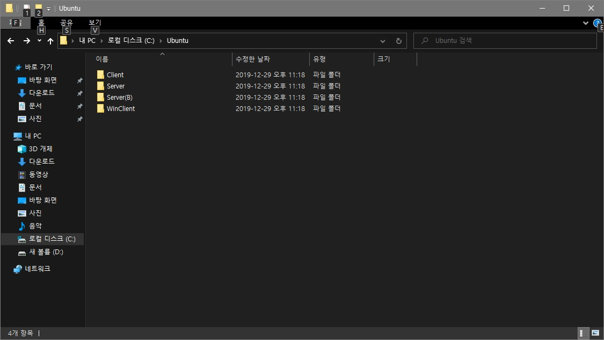
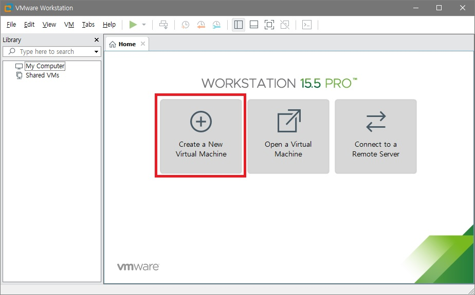

# Linux

### 환경 구축

* 원래는 1대의 컴퓨터에 리눅스만 설치해서 운영
* 실습을 위해 PC(Host PC)위에 가상머신을 사용하여 환경 구축
* 가상머신은 VMware workstation PRO를 사용
* 실습환경은 4개의 운영체제(Guest OS)를 설치한다

|           Server           |         Server(B)         |          Client          |     WinClient     |
| :------------------------: | :-----------------------: | :----------------------: | :---------------: |
| Ubuntu16.04 Desktop(64bit) | Ubuntu16.04 Server(64bit) | Ubuntu16.04 GNOME(64bit) | Windows 10(32bit) |

##### VMware의 특징

* 1개의 컴퓨터로 다중 OS 환경 구성이 가능하다
* OS의 특정 지점을 저장할 수 있는 스냅숏 기능이 있다
* 하드웨어를 입맛대로 장착, 조정 할 수 있다
* PC상태를 일시정지 할 수 있다

#### 1. 가상머신 생성

1. C:\ 밑에 Ubuntu폴더 생성 후 Server, Server(B), Client, WinClient폴더를 생성

   

2. VMware workstation PRO 실행 후 아래 Create a New Virtual Machine 클릭

3. I will install the operation system later 선택 후 Next

4. Linux 선택 후 Ubuntu 64-bit 선택 후 Next

5. virtual machine name을 Server로 하고, 위치를 1번에서 생성했던 Server 폴더로 지정

6. 용량을 80GB로 하고 Store virtual disk as a single file을 선택 후 Next

7. 이후 Next를 눌러 생성을 완료한다

8. Edit virtual machine settings를 눌러 셋팅을 한다. 나머지 OS의 셋팅 값은 밑의 표와 같다

|           | Server | Server(B) | Client | WinClient |
| :-------: | :----: | :-------: | :----: | :-------: |
| 하드 용량 |  80GB  |   40GB    |  20GB  |   20GB    |
|  메모리   |  1GB   |   512MB   | 512MB  |    1GB    |
|  CD/DVD   |   O    |     O     |   O    |     O     |
|  Floppy   |   X    |     X     |   O    |     X     |
|   Audio   |   X    |     X     |   O    |     X     |
|    USB    |   X    |     X     |   O    |     X     |
|  Printer  |   X    |     X     |   O    |     X     |

9. 4개의 가상머신 생성이 완료되었다

#### 2. VMnet8 네트워크 정보 변경

1. VMware workstation PRO의 Edit - Virtual Network Editor를 클릭

2. VMnet8을 선택한 후 Change Setting을 클릭

3. VMnet8을 선택 후 Subnet IP의 3번째 자리를 111로 바꾸고 OK 클릭

4. 명령프롬프트에서 ipconfig를 입력하여 VMnet8의 IPv4 주소가 192.168.111.1으로 보이는지 확인

